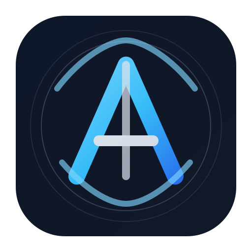

# MICHI

<div align="center">
  
</div>

<p align="center">
  <strong>The path from idea to software.</strong>
</p>

<p align="center">
  
  
  
  
  
</p>

MICHI is an engineering layer between a human and an AI coding agent. It helps turn vague product intent into clear requirements, structured decisions, architecture, and precise implementation instructions.

Instead of handing your agent a loose idea, MICHI turns it into a reliable engineering brief that keeps the project aligned, reviewable, and verifiable.

## Why MICHI exists

Most people do not struggle because AI cannot code. They struggle because they do not know how to tell an AI agent exactly what should be built, what constraints matter, and what decisions have already been made.

MICHI fills that gap.

- It asks the engineering questions a senior engineer would ask.
- It captures decisions as durable project memory.
- It prevents accidental architecture drift.
- It keeps project context small, relevant, and useful.
- It gives your coding agent a crisp brief instead of a vague wish.
- It records what was decided, why, and what changed later.

## The core idea

```text
You describe the goal in ordinary language
        ↓
MICHI asks the important engineering questions
        ↓
You choose the decisions that matter
        ↓
MICHI records them as project memory
        ↓
MICHI compiles a precise task brief
        ↓
Your AI coding agent implements it
        ↓
MICHI checks the evidence and keeps the project honest
```

## What MICHI is

MICHI is a local-first, open-source software engineering intelligence layer for AI-assisted development.

It does not replace your coding agent. It makes your coding agent significantly more effective by creating a disciplined bridge between:

- human intent
- product requirements
- engineering decisions
- technical architecture
- relevant project context
- actionable implementation instructions
- verification and review

## What MICHI is not

MICHI is not:

- a SaaS platform
- a hosted AI service
- a replacement for Claude Code, Codex, Cursor, Gemini CLI, Windsurf, Copilot, or similar tools
- a new AI model
- a cloud dependency
- a forced architecture system

MICHI is a local engineering control layer that improves how software gets built with AI.

## The problem it solves

A founder or product owner might say:

> “I want an app where customers can sign up, buy products, and track orders.”

That sounds clear, but it leaves many questions unanswered:

- Who are the users?
- What is the admin model?
- Which auth system should be used?
- What database and schema fit this product?
- What APIs are required?
- What is in scope for version 1?
- What should be deferred?
- How do we verify correctness?

MICHI helps convert that intent into a structured engineering understanding before implementation begins.

## How it works

MICHI has three layers:

1. Skills
   - The conversational intelligence layer that runs inside your existing AI coding agent.
   - It helps explore requirements, recommend decisions, ask clarifying questions, and keep the project grounded.

2. MICHI Core
   - Deterministic, local-first software with no mandatory AI dependency.
   - It validates project state, stores decisions, and manages project memory.

3. `.michi/`
   - A plain-text project brain that stores the decisions, requirements, architecture, and state that matter.

## Architecture in one glance

```text
Human idea
   ↓
MICHI discovery and decision workflow
   ↓
Requirements + approved decisions + architecture
   ↓
Context packet + implementation brief
   ↓
Existing AI coding agent
   ↓
Code + tests + review + verification
   ↓
Persistent project knowledge
```

## Key capabilities

### Decision-first workflow

MICHI recommends, explains, asks, confirms, and locks important product and engineering decisions before implementation continues.

### Project memory that lasts

Conversation is temporary. Project artifacts are durable. MICHI records decisions, requirements, and architecture in a way future agents can understand.

### Context engineering

MICHI does not dump entire repositories into every prompt. It selects only the relevant requirements, decisions, files, and constraints needed for the current task.

### Verification-first mindset

“An agent says it works” is not enough. MICHI treats evidence as a first-class concept, including tests, linting, build checks, and runtime verification.

### Minimal-complexity philosophy

MICHI encourages the smallest engineering solution that satisfies the approved requirement reliably, without unnecessary dependencies or premature abstraction.

## Project status

MICHI is currently in its specification and core planning phase.

| Phase | Status |
|---|---|
| 0 | Specification complete |
| 1 | `init` / `scan` / `status` complete |
| 2 | Senior-engineer workflow complete |
| 3 | Product-planning workflow complete |
| 4 | Architecture workflow complete |
| 5 | Context engine complete |
| 6 | Implementer workflow complete |
| 7 | Review, test, debug, verification | In progress |
| 8 | Agent adapters | Planned |
| 9 | Open-source release | Planned |

## Documentation

- [`MICHI.md`](MICHI.md) — the master product and product-design document
- [`docs/specs/README.md`](docs/specs/README.md) — engineering contracts and architecture specifications
- [`docs/specs/`](docs/specs/) — the specification set derived from the product vision

## The idea in one line

> You decide what you want. MICHI works out how it should be built. Your coding agent builds it.

## Why this matters

AI coding agents are already powerful. The bottleneck is not raw code generation—it is decision quality, architectural clarity, and context discipline.

MICHI is built to reduce that gap.

It helps people move from rough ideas to software with fewer wrong turns, less confusion, and better alignment between product intent and implementation.

## License

MIT. See [`LICENSE`](LICENSE).

---

<p align="center">
  <sub>Built for a clearer path from idea to software.</sub>
</p>
